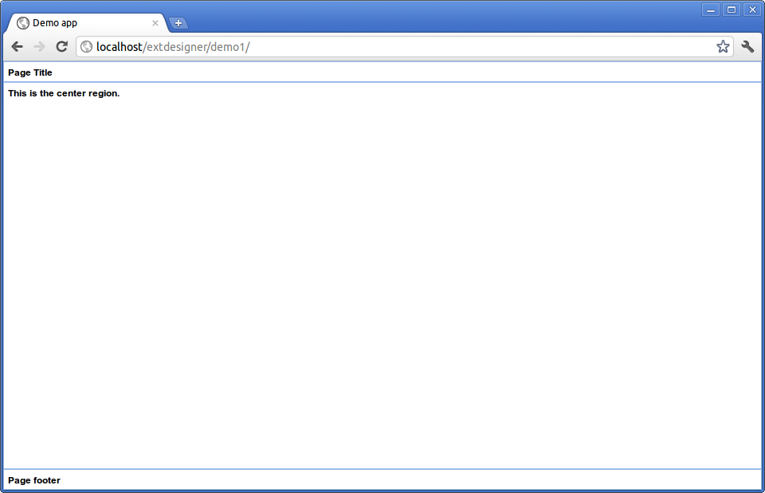

As in most web applications, there's a part that runs on the server, and other part that runs on the web browser. Our server part, will be an Lazarus CGI application, and our client part will be an ExtJs 4.0.x MVC application.

### ExtJs MVC client

At this stage, I'll create the basic skeleton of the client application. Since ExtJs 4.0.x we can opt for architecting our app following the MVC pattern, that consists of a group of Views, that interact with Models, by reacting to events generated by Controllers.

Each View is an ExtJs class, that can be as simple as a Panel containing a couple of labels, or a very complex  "composed" view, that can be created by attaching different "sub-views" to a main view. In our app, a simple view will be the customer's grid, it will be part of a composed main view containing a header with a Log-out button and a center region with the grid.

Views must be managed by one or more controllers, the controller will listen or trigger events to views. For example, the "click" event of a button must be handled by a controller, not by the view that contains the button.

A minimal application is composed by an .html file and a .js file. 

> Note: here I assume you have a web server (like Apache or Lighttpd) already installed and working, also that you have copied all ExtJs files to the `documentRoot` in a directory named `ext-4`.

Here's an example of an `index.html` file:

    <html>
    <head>
        <title>Demo app</title>
        <link rel="stylesheet" type="text/css" href="/ext-4/resources/css/ext-all.css">
        
        
    </head>
    <body></body>
    </html>

As you can see, the file only contains references to ExtJs resources and scripts, and a script named `app.js`, that is our main application file. That file looks like this:

    Ext.Loader.setConfig({enabled:true});
    Ext.application({
        name: 'DEMO',
        appFolder: 'app',
        controllers: [],
        autoCreateViewport: true,
        launch: function() {
        }
    });

This file tells that our files will live in the `app` directory, its namespace will be `DEMO` and the Viewport will be created automatically, the Viewport is the area where the application will be rendered, usually the whole browser window. As it doesn't have any controller nor view, it won't do anything.

Before continuing, I strongly recommend you to read [ExtJs MVC application architecture](http://docs.sencha.com/ext-js/4-0/#!/guide/application_architecture).

Let's try to "visualize" our folder structure:

    app.js
    index.html
    app\
       \model
       \view
          Viewport.js
       \controller

As the diagram shows, the app consists of only three files `app.js`, `index.html` and `app/view/Viewport.js`, also I predefined model and controller directories.

I know you are eager to test something, so let's create the `app/view/Viewport.js` file as this:

    Ext.define('DEMO.view.Viewport', {
        extend: 'Ext.container.Viewport',
        layout: 'border',
        initComponent: function() {
            Ext.apply(this, {
                items: [
                    {
                        region: 'north', 
                        html: '<h1 class="x-panel-header">Page Title</h1>'
                    },
                    {
                        region: 'center',
                        html: '<h1 class="x-panel-header">This is the center region.</h1>'
                    },
                    {
                        region: 'south', 
                        html: '<h1 class="x-panel-header">Page footer</h1>'
                    },
                ]
            });
            this.callParent();
        }
    });

Now copy all the directory structure to your http server's documentRoot's, under a directory called `demo1` for example, and open a browser in `http://localhost/demo1`. If everything went ok, your app should look like this (I'm using Google Chrome):

