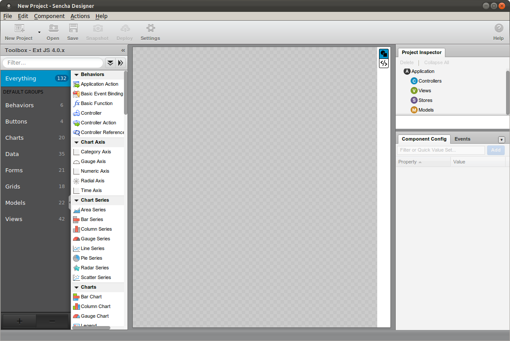
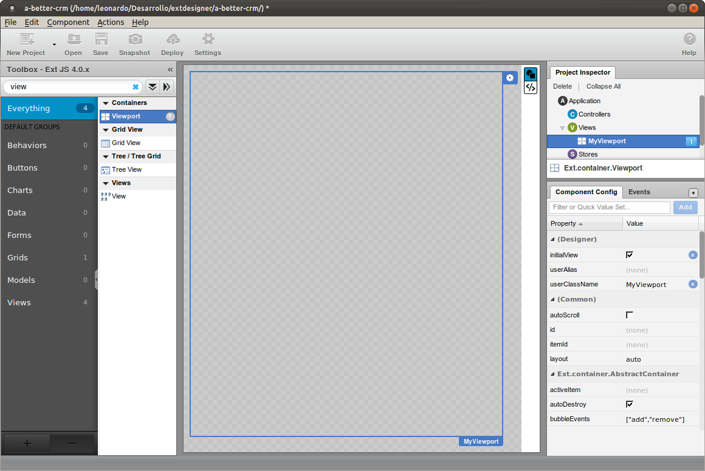
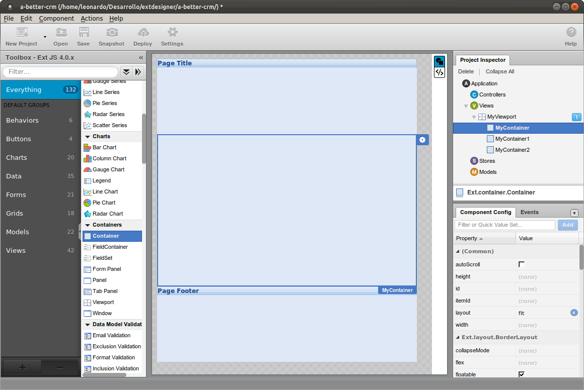
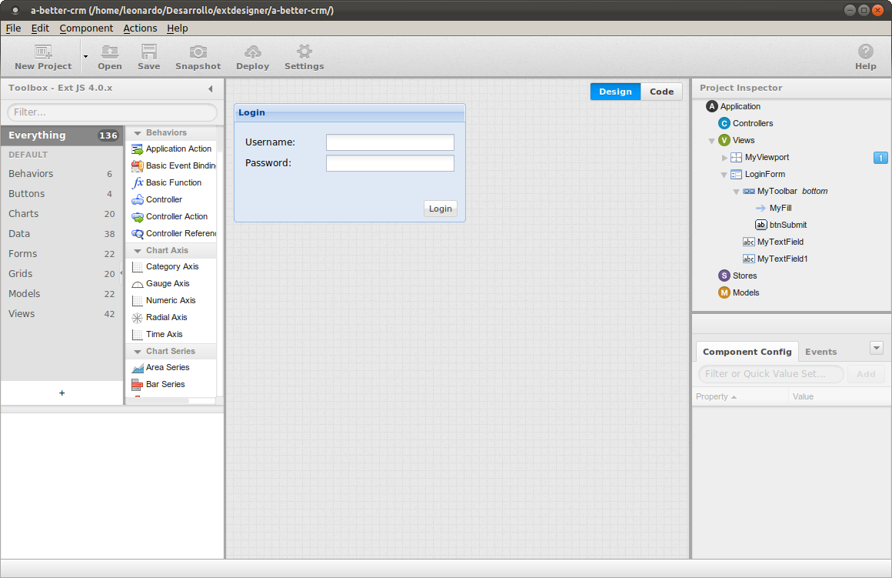

Traditionally, ExtJs projects were developed using text editors like Vim, Emacs or Notepad, and today you can continue using it, but there's a new tool to help building ExtJs applications: Sencha Designer.

Sencha Designer is the new evolution of ExtJs Designer. The previous version allowed us to create Views that can be integrated to our projects, and extended using a text editor, but the newest incarnation allows much more than that, now it's a complete-ide, even with a text editor included.

One drawback (to me) of the new Sencha Designer is that if you choose to create a project using it, you will be forced to use it from the very beginning of your application. For example you can't start an app using your text editor, then continue using Sencha Designer, for me this is a major problem. Imagine a workgroup composed of some developers using Sencha Designer (front end designers) and others using just text editors, if a programmer adds a View by hand, this view is not imported automatically to Sencha Designer and can't be modified by the front end designer.

I'm not the only developer who thought about this, please take a look at this thread:  http://www.sencha.com/forum/showthread.php?153742-Add-a-new-Component-in-Designer-2&langid=4

Having said that, I'll explain how to create our project using Sencha Designer from the beginning.

### Step 1 - Create the viewport

When first openned Sencha Designer you'll see this:

Before continuing, please take a look a this page http://www.sencha.com/blog/sencha-designer-beta for some introductory information about the product.

The first thing I usually do after creating a new, empty ExtJs 4 project is going to File->Save Project As... and save the project with the name a-better-crm.xds. This will create the directory "a-better-crm" and the following files inside it:

    designer.html
    designer.js
    undefined.xds

As you can see, the file "undefined.xds" is our  main project file, I don't know why Sencha Designer doesn't named this file "a-better-crm.xds", probably because of a bug. But don't worry, you can go to File -> Save As... again an rename the project file.

Now that the basic project structure is defined, you can take a look at the generated files:

**designer.html**

    <!DOCTYPE html>

    <!-- Auto Generated with Sencha Designer -->
    <!-- Modifications to this file will be overwritten. -->
    <html>
    <head>
        <meta http-equiv="Content-Type" content="text/html; charset=utf-8" />
        <title>a-better-crm</title>
        <link rel="stylesheet" type="text/css" href="http://extjs.cachefly.net/ext-4.0.2a/resources/css/ext-all.css"/>
        
        
    </head>
    <body></body>
    </html>

> Note. By default, Sencha Designer defines the ExtJs path to "http://extjs.cachefly.net/ext-4.0.2a". I prefer to point to my local Apache server by going to Edit -> Project Settings and replacing the "Ext JS Path" field with "http://localhost/extjs-4/" (my extjs 4.0.x files are stored in /var/www/ext-4).

**designer.js**

    /*
     * File: designer.js
     *
     * This file was generated by Sencha Designer version 2.0.0.
     * http://www.sencha.com/products/designer/
     *
     * This file requires use of the Ext JS 4.0.x library, under independent license.
     * License of Sencha Designer does not include license for Ext JS 4.0.x. For more
     * details see http://www.sencha.com/license or contact license@sencha.com.
     *
     * This file will be auto-generated each and everytime you save your project.
     *
     * Do NOT hand edit this file.
     */

    Ext.Loader.setConfig({
        enabled: true
    });

    Ext.application({
        name: 'MyApp',

        launch: function() {

        }
    });

> Please, review my [Application structure notes](Application-structure) for more info about the basig project structure.

Now, to create the Viewport, just type in the filter on the left hand side the word "view", and the list of components will automatically show all components who's name starts with "view". Then drag the component "Viewport" to the big gray area in the middle of the screen.

The result must be this:

By default, the Viewport's layout is Anchor. Our project needs a vieport's type Border, so, please change the layout property to border in "Component Config". After this change, the Viewport will show the message "Please add the required 'center' region.".

Now, you'll have to create the north, center and south panels. Just drag the component "Container" from the component toolbox to the viewport, and change the property "Region" of each container to north, center and south, as needed.

The next step is to edit container's html property as follows:

Select the north container in Project Inspector, then look for the html property in Component Config, and type this:

    <h1 class="x-panel-header">Page Title</h1>

On south container  type this:

    <h1 class="x-panel-header">Page footer</h1>

In the center container, do not edit its html property. Only change its layout property to "fit".

The result will be this:

### Step 2 - Create the LogIn window

To create the LogIn window, just find the Window component in the Toolbox and drag it to the "Project Inspector", then drop in Views. The result is this:

Double click on the window's title and replace "My window" by "Login".

Now, drag a Form Panel component over the new window, then check the "preventHeader" property, to hide the title of the Form Panel.

To add the User and Password fields, just drag two text fields to the form panel. By default, its caption is "Label", just double click on each one and replace to "Username" and "Password". 

